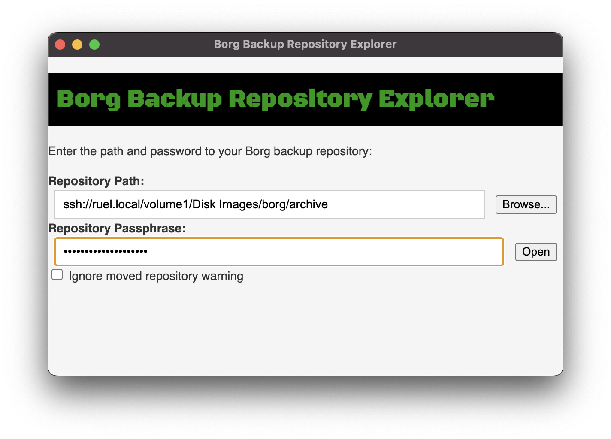
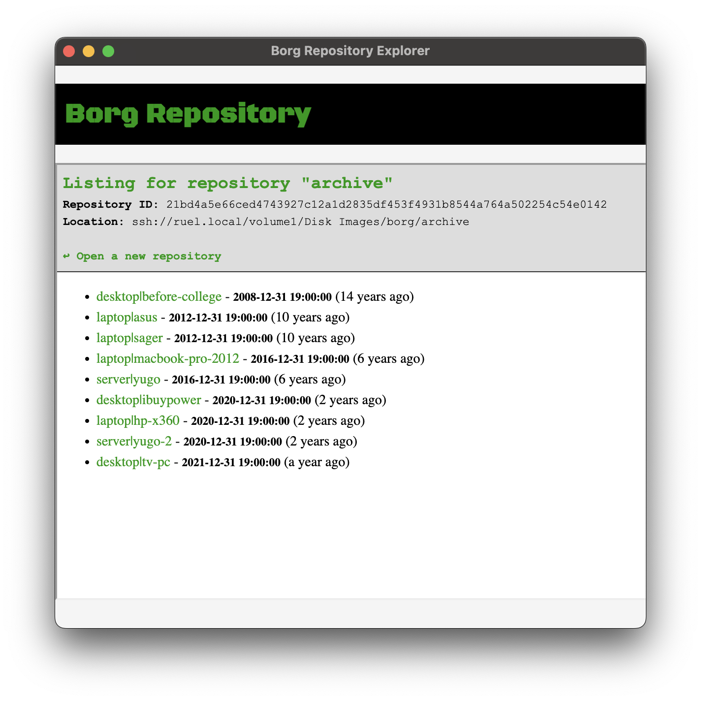
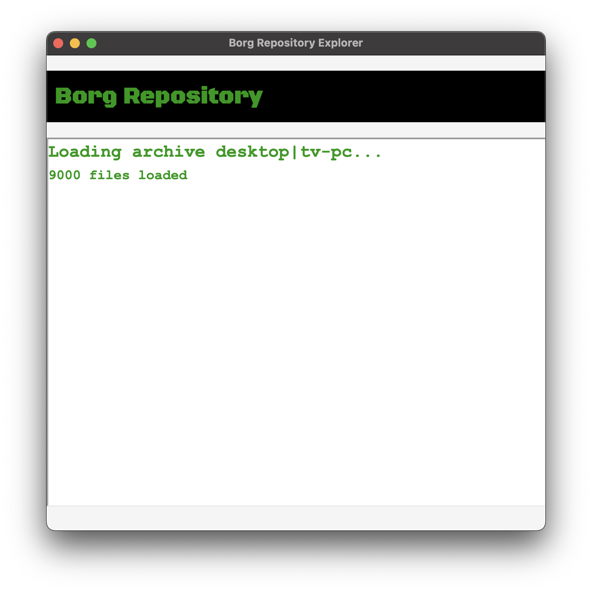
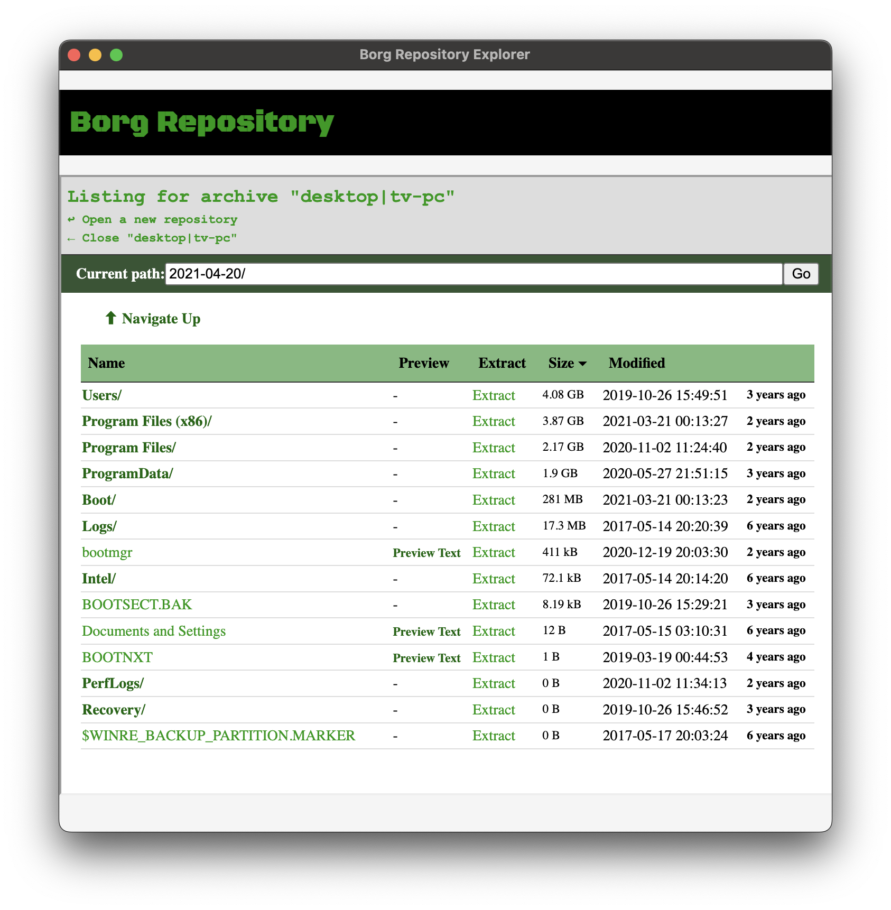
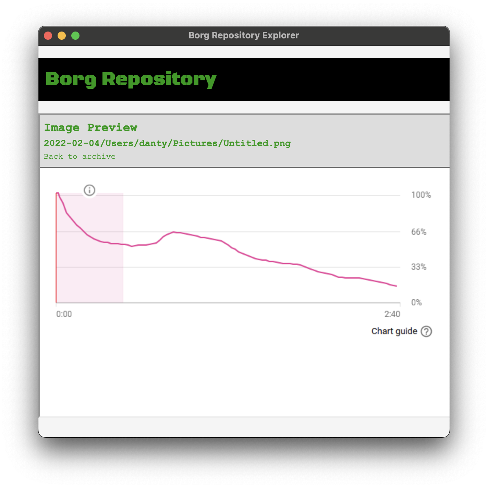
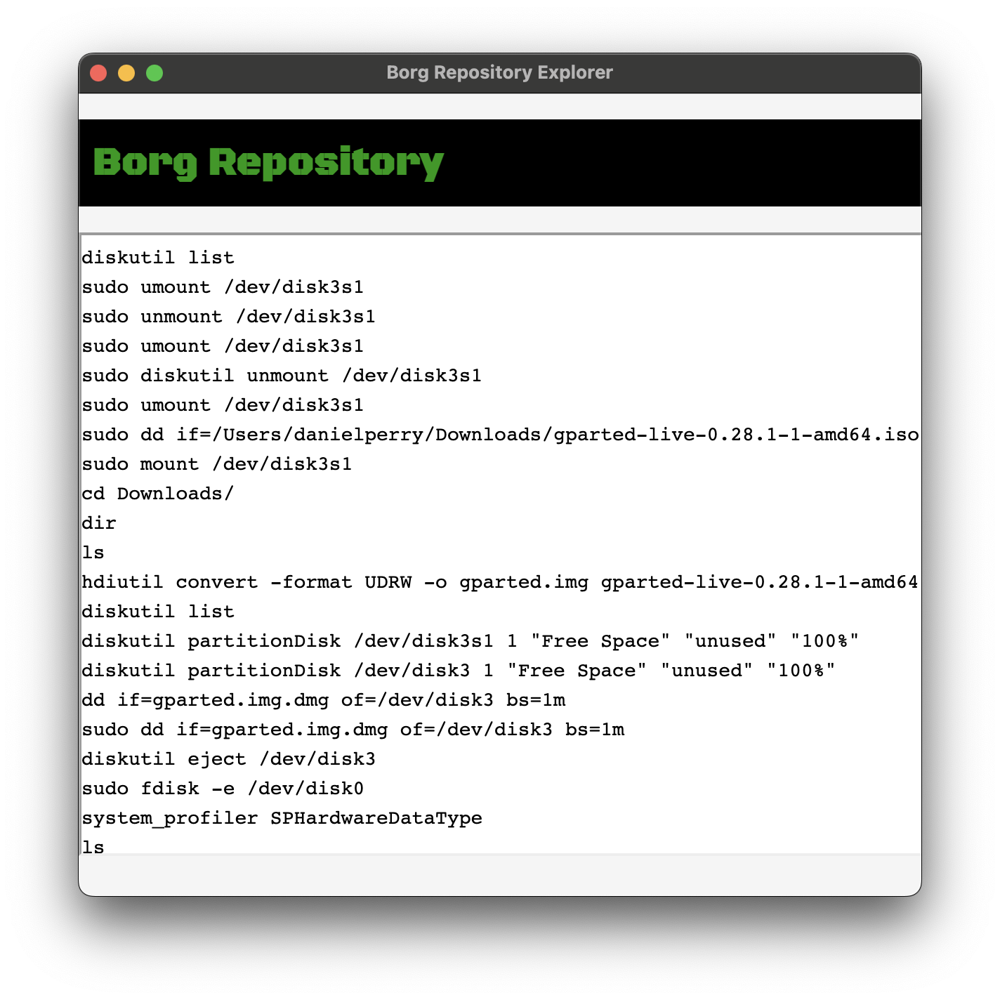
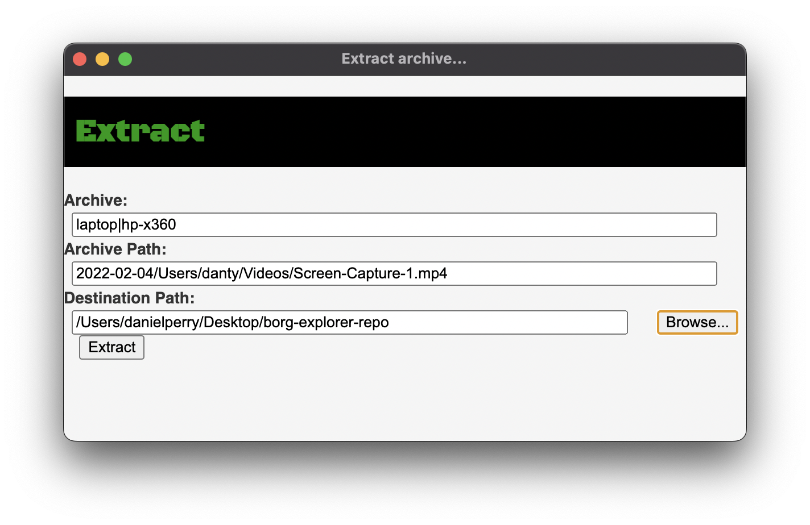

# Borg Backup Repository Explorer

## Downloads
You can find download links on the [releases](https://github.com/Netruk44/borg-repository-explorer/releases) page. Expand the "Assets" section to find the download links.

#### Note about MacOS Gatekeeper
> I don't have an Apple Developer account, it costs $99/year and this is literally the only Mac app I've ever made, which means I can't sign this app.
> 
> What that means **for you** is that MacOS won't let you run this program unless you're an administrator and can approve specific unsigned apps to run on your machine (you probably are).
> 
> By default, if you double click Borg Explorer, MacOS will show a warning and only let you move the application to the trash. If you have administrator rights, you can right click Borg Explorer, then select "Open". You'll then get a different dialog that will let you continue to run the program.
> 
>> **Note**: Borg Explorer itself does not need administrator permissions in order to run. Administrator permissions are needed solely to approve the unsigned program to run.

## Current State

Usability and style are rough, but functionally this project is mostly complete. The remaining changes are mostly usability-related, and adding support for the upcoming Borg 2.0.

You can blame the AI's for how it looks, I have no taste for HTML and CSS 😊. The poor UX is definitely my fault, though. You should expect unexplained waits while things run in the background with no progress indicator whatsoever 😅.

### Implemented
* Browsing for a repository directory.
* Verifying a passphrase is correct for a Borg repository.
* Listing archives contained within a Borg repository.
* Very rudimentary listing of files contained within an archive.
* Previewing archive contents in the explorer
  * Image previews: `.jpg .png .gif .bmp .tiff .webp`
  * Text previews: `.txt .md .sh .html .js .cs .cpp .c .h .yml .json, etc.`
  * **TODO**: Video previews
* Extracting files and directories from an archive.
* Very primitive settings menu for setting borg installation path.
* SSH support
  * Support for setting '--remote-path' via settings menu.
 
[Screenshots](#screenshots) are available below.

----

## About the Project

This repository contains a personal project, a simple GUI for exploring [Borg Backup](https://borgbackup.readthedocs.io/en/stable/) repositories. It's mainly intended for MacOS where FUSE/`borg mount` requires jumping through hoops, though there is also a Linux build available.

Borg Backup Repository Explorer, or just "Borg Explorer" for short, provides a simple way to browse, preview, and extract files from a Borg repository. It does this by running `borg` commands in the background to read information from the repository. There are no requirements to install FUSE or any other software besides Borg to use this project.

This project comes with no guarantees, and may not be maintained indefinitely. However, I do personally use this to browse my own Borg repositories, so I will likely continue to make updates for as long as I use Borg, ~~if~~ when I find issues or have ideas for improvements.

This project was created with assistance from [ChatGPT](https://chat.openai.com/chat) and [Copilot](https://copilot.github.com).

### Why?

I use Borg to backup my machines and have started using it to manage my old computer backup archives. Sometimes, I like to browse these archives for files and extract them for interest/nostalgia's sake.

The usual way of browsing Borg archives is to use `borg mount`, which uses FUSE to mount the repository as a directory on your machine. However, my current main machine is a MacBook Pro. Macs don't natively support FUSE, so you have to do a bit of work before you can use `borg mount`.

Before I started this project, my only options for graphically browsing an archive on my Mac were:
* Installing FUSE on the Mac to run `borg mount` and browse the repository with Finder.
  * Installing FUSE requires you to disable some security settings on your Mac.
  * Some people may not want to (or in some cases be able to) disable the security settings required to install FUSE. What about them?
  * I have no aversion to disabling the security settings, but I currently have no other use for FUSE on my Mac. It would be nice if I could avoid going through the process of installing it.
* Mount the repository on a remote Linux machine and do some ssh magic to make it visible to Finder.
  * I can run borg on my Mac locally. Why should I have to involve another machine for this?
* Mount the repository on a Linux virtual machine and use some kind of sharing to make the mount visible to Finder.
  * Borg runs without the VM. I shouldn't need to start one just to get a graphical file list.

Then there's the non-graphical alternative, `borg list`. But by default, `list` dumps info about every file in the entire archive...unless you come up with a regular expression to filter out the files & directories you do/don't want. I don't love coming up with regular expressions on the fly inside Terminal.app? Maybe I could make a program to parse that output instead...🤔. And so Borg Explorer was born.

I've never written anything using Electron before and wanted an excuse to learn it, and this seemed to be a good fit. I wanted to be able to preview videos, images and text files within the app, so it felt like an acceptable use of Electron. And the fun new thing to do is to make ChatGPT build your entire webapp for you. So, I decided to go ahead and give it a shot.

At some point, figuring out how to start a fresh conversation with ChatGPT (setting up a chat question with the required context to generate the kind of code I was looking for) was too much work, so I switched over to using Copilot instead. 

## Screenshots

Listing of archives within a repository.

Loading an archive

Listing of files within an archive.

Previewing an image within an archive.

Previewing a text file within an archive.

Extracting a file from an archive.

