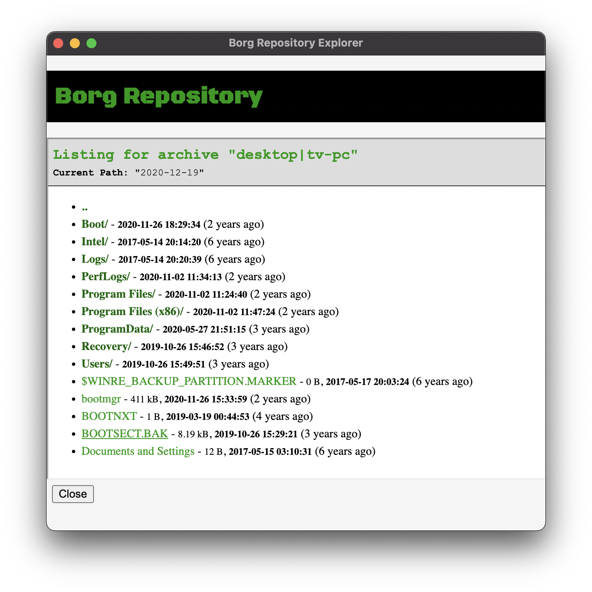

# Borg Backup Repository Explorer

This repository contains a personal project that is a simple GUI explorer for a Borg backup repository.

This project is is a **⚠️Work In Progress⚠️**, and it is not guaranteed to be completed or maintained.

This project was created with assistance from [ChatGPT](https://chat.openai.com/chat) and [Copilot](https://copilot.github.com).

## Current State

Still in early development. Nearly no functionality is implemented yet, and usefulness is limited.

### Implemented
* Browsing for a repository directory.
* Verifying a passphrase is correct for a Borg repository.
* Listing archives contained within a Borg repository.
* Very rudimentary listing of files contained within an archive.

### Not Implemented
* Viewing or extracting files from an archive.

## Screenshot(s)

